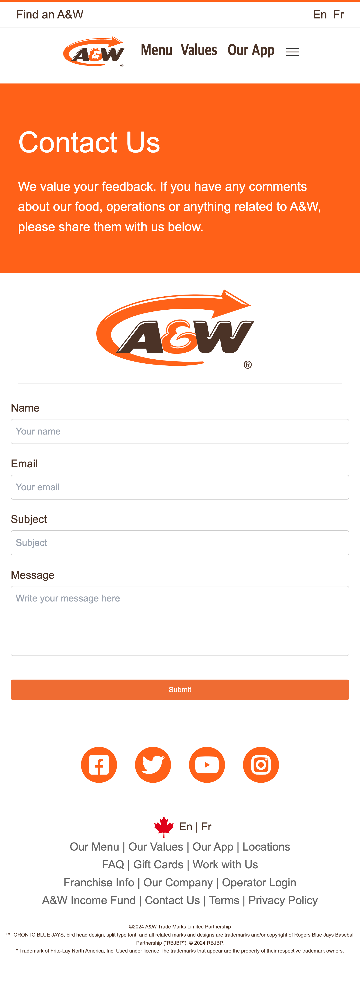
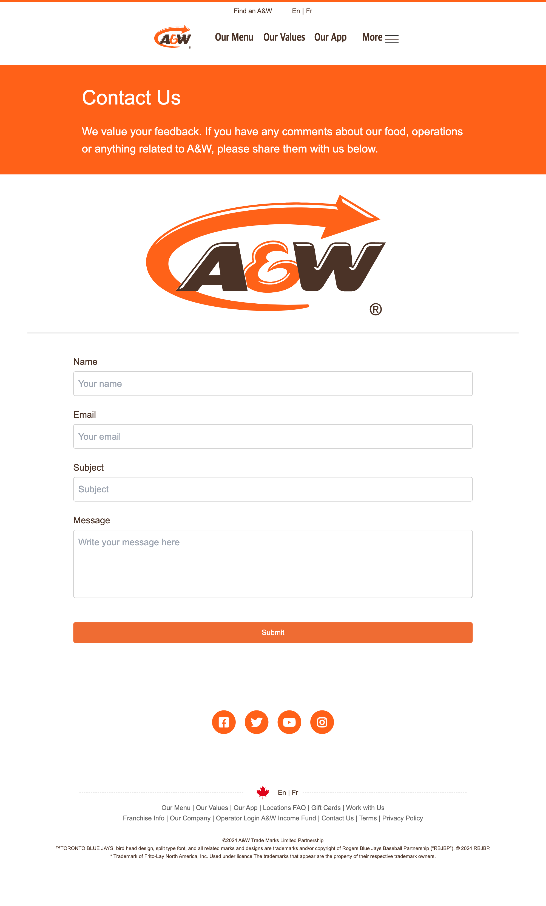
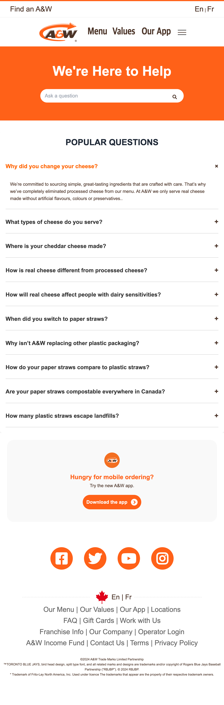
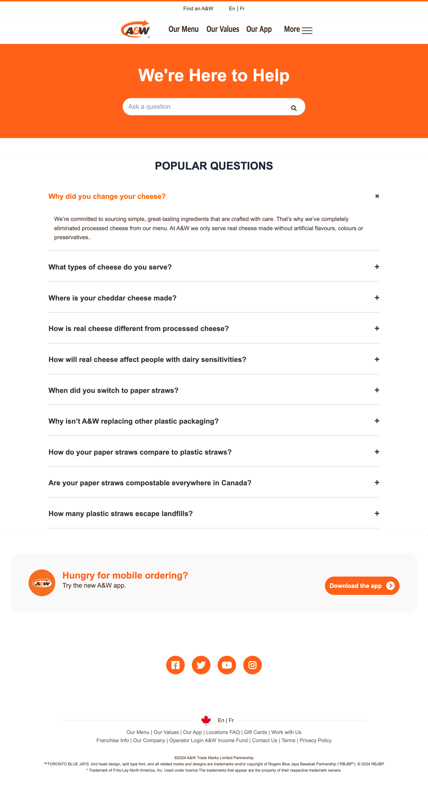
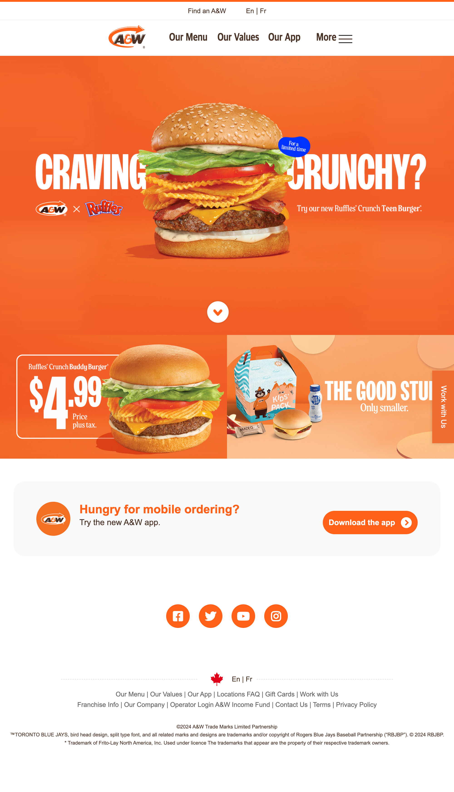
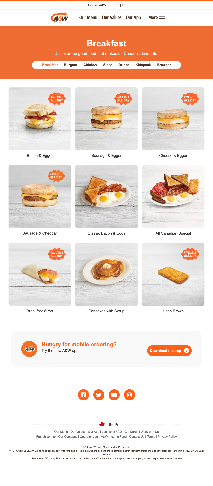
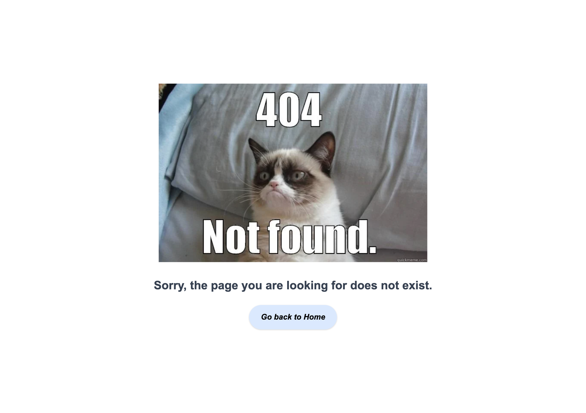

# A&W Clone Webpage
## 🌻Demo Page
https://aw-burger-clone.netlify.app

## 🌻Description
This project is a final project in Tamwood for 2nd module.
The goal of this project is to learn a responsive webpage using HTML and CSS.

## 🌻Getting Started
- Development Environment: macOS Sonoma 14.5
- Development Tools: Visual Studio Code
- Technology Stack: HTML, CSS, JavaScript

## 🌻Authors and Contributors
- **Author:** Yunju Jo (Yun)
- **Referenced Design:**
  - [A&W Webpage](https://web.aw.ca/en/home?gad_source=1&gbraid=0AAAAADNhAK4_kC912xkGsTCgNPtATUVVI&gclid=CjwKCAjw6c63BhAiEiwAF0EH1EW4pdJDHKxJvxqkUvqDxzIhJW5fNhUOqgiKaerGUuLNkZa4bFzljhoCWIQQAvD_BwE)

## 🌻How to use
1. Clone the repository: `git clone [[repository URL](https://github.com/Yunzoo01/aw-burger-clone)]`
2. Open the `index.html` file in your web browser.
3. Ensure that all assets are in the correct directories.

## 🌻Features

## 🌻Key Code

## 🌻Screen shots

  
  

  
  

  
  

  
  

  

